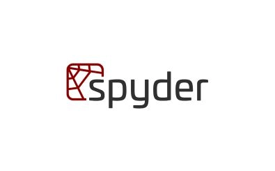
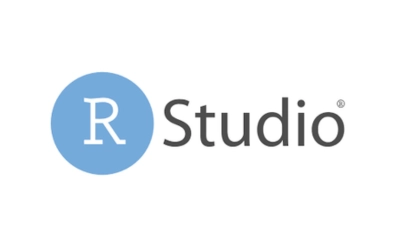
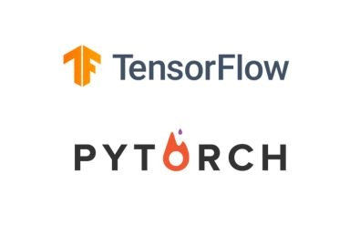
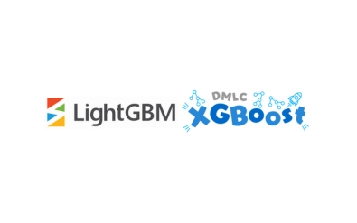
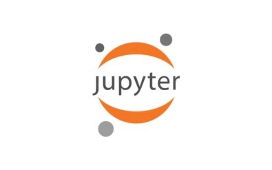
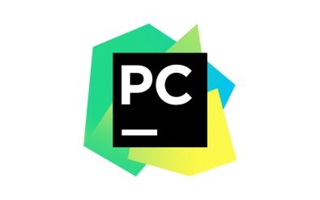
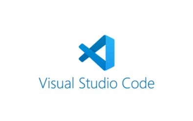
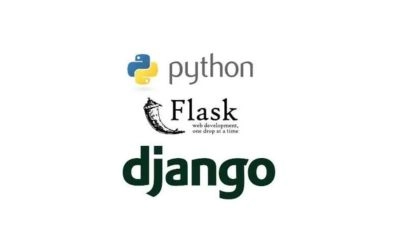
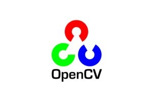
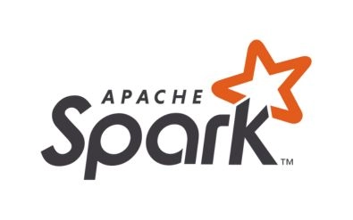

# Anaconda vs Python: Which Tool Actually Fits Your Data Science Workflow?

You're staring at your screen, ready to dive into machine learning. But here's the thing—do you grab Python and build everything from scratch, or do you let Anaconda handle the setup while you focus on the actual work?

Think about it like this: Python is that reliable toolkit where you pick exactly what you need. Nothing extra, nothing you don't want. But yeah, you're assembling everything yourself—installing libraries, fixing conflicts, making sure versions play nice together.

Anaconda? It's more like showing up to a fully equipped workshop. Everything's already there—Jupyter Notebook, TensorFlow, Pandas, the works. You just... start working. No assembly required.

So which one makes sense for you? If you like having complete control and keeping things lean, Python's your move. But if you'd rather skip the setup headaches and get straight to building models, Anaconda's probably the smarter choice.

Let's break down what actually matters when you're choosing between these two.

---

## What Anaconda Actually Is

Anaconda is basically Python with training wheels—except the training wheels are actually sophisticated tools that professionals use every day.

It's an open-source distribution that comes loaded with Python (and R, if you're into that), plus around 7,500 pre-installed packages for data science and machine learning. The real MVP here is Conda, the package manager that handles dependencies way better than manually juggling versions.

You also get development environments like Jupyter Notebook and Spyder right out of the box. No hunting down installation guides or troubleshooting compatibility issues at 2 AM.

For data scientists, this is kind of a big deal. You can create isolated environments for different projects, which means your TensorFlow 2.0 project won't explode when you need to maintain something built on TensorFlow 1.x.

## Why People Actually Use Anaconda

### It Comes With Everything Already Installed

Here's what you get without lifting a finger:
- NumPy for crunching numbers
- Pandas for wrangling messy data
- Matplotlib and Seaborn for making things visual
- Scikit-learn for machine learning basics
- TensorFlow and Keras when you need deep learning

No manual downloads. No "why isn't this working" moments. It just works.

### Conda Makes Package Management Less Painful

Conda is like pip's older, wiser sibling. It automatically handles dependencies, so you're not stuck in version hell. Need to switch between Python 3.8 and 3.11? No problem. Want to install non-Python packages? Conda's got you.

👉 [**See how data scientists are building faster ML pipelines with proper environment management**](https://www.scraperapi.com/?fp_ref=coupons)

### Environment Management That Actually Works

You can spin up separate environments for each project. This means:
- Running different Python versions across projects
- Avoiding the classic "it works on my machine" problem
- Sharing reproducible setups with your team

Imagine working on two projects—one needs TensorFlow 2.0, the other's stuck on 1.x. With Anaconda, you just switch environments. Done.

### Built-In Development Tools

**Jupyter Notebook** lets you write code, see results, and document everything in one place. Perfect for exploratory analysis or explaining your work to non-technical folks.

**Spyder** gives you that MATLAB-style IDE if that's your jam.

**RStudio** is there if you need to hop between Python and R.

Plus, Anaconda plays nice with PyCharm, VS Code, and other IDEs you might already be using.

### It Works Everywhere

Windows, macOS, Linux—doesn't matter. Anaconda gives you the same experience across all platforms. No weird compatibility issues when you share code with someone on a different OS.

### Optimized for Machine Learning and AI

Anaconda isn't just throwing libraries at you. It's optimized for the heavy lifting:
- Deep learning frameworks like TensorFlow, Keras, and PyTorch
- GPU acceleration for faster training
- Integration with Dask for parallel computing on massive datasets

## What Integrates With Anaconda


**Jupyter Notebook** – Write code, visualize data, and document your process all in one place. Great for prototyping and sharing insights.



**Spyder** – A MATLAB-like IDE built specifically for scientific computing. If you're coming from MATLAB, this'll feel familiar.



**RStudio** – For when you need to work with both Python and R. Anaconda handles the integration seamlessly.


**Dask** – Scales up your computations across multiple cores or even distributed systems. Essential when you're dealing with datasets that don't fit in memory.



**TensorFlow & PyTorch** – The go-to frameworks for deep learning. Anaconda includes GPU support out of the box, so you can actually train models in reasonable timeframes.


**Scikit-learn** – Your workhorse for traditional machine learning algorithms—classification, regression, clustering, you name it.



**XGBoost & LightGBM** – Gradient boosting algorithms that win Kaggle competitions. If you're serious about predictive modeling, you'll use these.

---

## What Python Actually Is (Without Anaconda)

Python is the programming language itself—versatile, clean, powerful. It's used for web development, automation, data science, AI, and basically everything else.

Unlike Anaconda's all-in-one package, standard Python is lean. You install what you need when you need it using pip, Python's default package manager.

This gives you complete control. But yeah, you're doing the work yourself—installing libraries, managing versions, troubleshooting when things break.

## Why Python (Without Anaconda) Still Makes Sense

### Simple Syntax That Doesn't Get in Your Way

Python reads like English. Seriously, printing "Hello, World!" is just:

```python
print("Hello, World!")
```

This simplicity means you spend less time decoding syntax and more time solving actual problems.

### Libraries for Everything

Python's ecosystem is massive:
- **Data work**: NumPy, Pandas, Matplotlib
- **Machine learning**: Scikit-learn, TensorFlow, PyTorch
- **Web development**: Flask, Django
- **Computer vision**: OpenCV
- **Web scraping**: Requests, BeautifulSoup

Whatever you're building, there's probably a library for it.

### Runs Anywhere

Python works identically on Windows, macOS, and Linux. Write once, run everywhere. No surprises.

### Multiple Programming Styles

Python supports both object-oriented programming (classes, inheritance) and functional programming (lambda functions, list comprehensions). Pick what works for your project.

### Massive Community

When you're stuck, someone else has probably hit the same wall. Stack Overflow, GitHub, Reddit—there's always someone who can help. Plus, the language keeps evolving with regular updates.

### Flexible and Scalable

Need better performance? Use Cython to compile critical sections to C. Working with huge numerical computations? Numba can optimize those on the fly.

### Great for Automation

Python excels at automating repetitive tasks:
- Web scraping with BeautifulSoup and Scrapy
- File operations with os and shutil
- System administration scripts

It's basically the Swiss Army knife of scripting languages.

### Plays Well With Others

Python integrates smoothly with C, C++, Java, .NET, and big data technologies like Hadoop and Apache Spark. If you're working on multi-language projects, Python bridges those gaps.

## What Integrates With Standard Python



**Jupyter Notebook** – Interactive environment for running code, visualizing data, and documenting your process. You can use this with standard Python too, not just Anaconda.



**PyCharm** – Full-featured IDE from JetBrains with smart code completion, debugging, and version control integration.



**VS Code** – Lightweight, extensible, and packed with Python support. Great balance between simplicity and power.



**Flask & Django** – Flask for lightweight web apps, Django for full-scale applications with built-in authentication and admin panels.


**TensorFlow & PyTorch** – Deep learning frameworks that work perfectly with standard Python installations.


**Selenium** – Automate browsers for testing or scraping dynamic websites.



**OpenCV** – Computer vision library for image and video processing. Face recognition, object detection, AR applications.



**Apache Spark** – Distributed computing for big data. Python connects through PySpark for large-scale data engineering.

---

## Anaconda vs Python for Machine Learning

When it comes to ML, Anaconda has some clear advantages. It comes with Scikit-learn, TensorFlow, and PyTorch already installed. Conda handles dependencies better than pip, and Jupyter Notebook is built in for testing and visualizing models. Plus, GPU support with CUDA is simplified.

Standard Python is better if you want a lightweight setup and don't mind installing libraries manually. It's more flexible, works great in production environments, and integrates smoothly with cloud platforms. For deploying ML models with Flask or FastAPI, standard Python is usually the better choice.

👉 [**Learn how teams are deploying ML models faster with streamlined Python environments**](https://www.scraperapi.com/?fp_ref=coupons)

## The Key Differences That Actually Matter

| **Aspect** | **Anaconda** | **Standard Python** |
|------------|-------------|---------------------|
| **Setup** | Pre-installed with 7,500+ packages | Install Python, then add libraries as needed |
| **Package Manager** | Conda (handles dependencies automatically) | pip (manual dependency management) |
| **Environment Management** | Built-in, easy to create isolated environments | Requires virtualenv or venv |
| **Use Case** | Data science, ML research, academic projects | Web development, production deployment, general programming |
| **Size** | Large (several GB) | Lightweight (under 100 MB) |
| **IDE Included** | Jupyter Notebook, Spyder | Separate installation required |
| **Learning Curve** | Easier for beginners | Requires more setup knowledge |

## When to Use Which One

**Choose Anaconda if:**
- You're just starting with ML and want a simple setup
- You need pre-installed libraries like TensorFlow and PyTorch
- You use Jupyter Notebook regularly
- You want hassle-free environment management
- You're focused on data science, AI research, or academic work

**Choose Standard Python if:**
- You prefer a lightweight, flexible setup
- You're deploying ML models to production
- You're comfortable managing dependencies yourself
- You're building end-to-end applications (not just research)
- You work with Docker or cloud platforms

---

## The Bottom Line

Both tools have their place. Python is the flexible foundation you can build anything on. Anaconda is the specialized toolkit that makes data science and machine learning faster and less frustrating.

If you're a general developer working on varied applications, stick with Python. If you're a data scientist or ML engineer who just wants to focus on building models instead of fighting with environment setup, Anaconda will save you hours of hassle.

Pick the tool that matches how you actually work, not what sounds impressive.

## FAQs

**Can I use Python without Anaconda?**  
Absolutely. Python works perfectly fine on its own—you'll just use pip to install packages as you need them.

**Can I install both Anaconda and Python together?**  
Yes, but be careful with environment variables and paths to avoid conflicts between the two installations.

**Is Anaconda slower than Python?**  
Anaconda is larger (several GB vs under 100 MB), so it takes more time to load environments. But execution speed for your code is the same.

**Is Anaconda free?**  
Yes, for individual users. There are enterprise versions with additional features and support.

**Do professional data scientists use Anaconda?**  
Many do, especially for research and prototyping. It's common in academia and data science teams, though production deployments often use standard Python.
